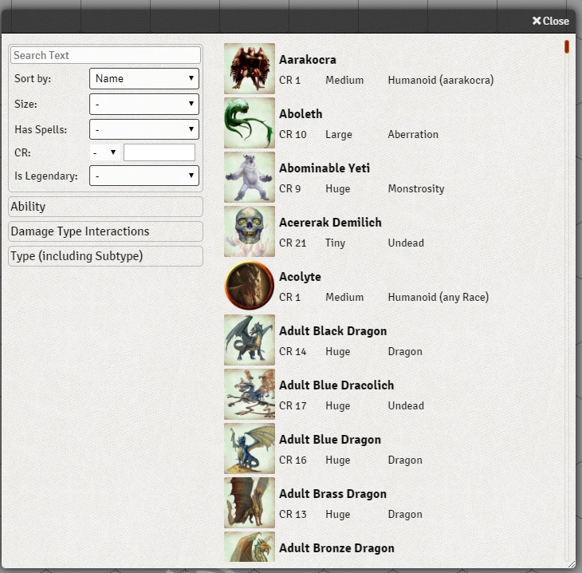

# NPC Browser
A way to browse compendium NPCs and sort/filter them with various filters.

You can filter by any attribute a NPC can have, either by using one of the predefined filters, or by using the advanced text filter at the top. You can access the Browser in the Compendium section of the sidebar

### Settings
As a GM you can set which Compendie should be loaded. The more compendie are selected, the longer is the loading time. After the first load the module will cache all NPCs, so the loadtimes does not affect the actual app unless its opened before the loading is done.
You can reset settings by right clicking the settings button.

### Advanced Text Filter
This filter can filter by multiple attributes. If you want to filter by name, only put in the name, for any other attribute, you have to set the attribute before setting the search term. This is indicated by using an operator. You can use `:` any Text or `=`, `<` and `>` for any number comparisents. You can also apply multiple filters by deviding them with `,`.

You can use any attribute an NPC can have by either using the Label or the actual refrence name of the attribute in the database.

All text filters ignore upper case and you don't have to match the whole string in your search query.
Example: `fire, damage:d6` shows all spells that have fire in their name and a d6 in the damage field.

### Is Legendary
This filter allows you to quickly find stronger, boss type NPCs. Any NPC with either at least 1 Legendary Action or Legendary Resistance in their respective ressources will be categorized as Legendary.

### Damage Type Interactions
Here you can filter NPCs depending on ceratin damage interactions. You can either look up any NPC that can deal a certain type of damage, or look for NPCs that have a certain damage type in their list of immunitys, resistances or vulnerabilitys

### Type
This module analyzes all loaded NPCs to guess their type and subtype that match the following format: `Type (Subtype)`. Any Type or Subtype that has been found is then available to filter, so you can hunt for specific types of monsters.

#### Thanks for using this module

If you have any suggestions or problems concerning this module, feel free to contact me in discord (Felix#6196) or per email (syl3r31@gmail.com).

If you feel like supporting my work, feel free to leave a tip at my paypal felix.mueller.86@web.de
